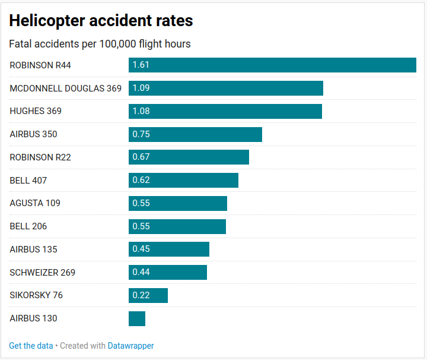

# palewire-first-python-notebook
Tutorial from [https://palewi.re/docs/first-python-notebook/appendix/index.html](https://palewi.re/docs/first-python-notebook/appendix/index.html)



## Data
[ntsb accidents](https://raw.githubusercontent.com/palewire/first-python-notebook/main/docs/src/_static/ntsb-accidents.csv)
[faa_survey data](https://raw.githubusercontent.com/palewire/first-python-notebook/main/docs/src/_static/faa-survey.csv)


## Summary of things we learnt

- Panda series turn lists into more useful things that we can `.max(), .min(), .sum(), .mean(), .describe()`
- You can import data from a url using `pd.read_csv(url)`
- A Series in 1 dimensional, and a dataframe is 2 dimensional
- df.info() tells you stuff about the df
- You can do lots of things with dataframes! Eg. `df['column']` or df.column to list a specific column. Then you can append `.sum()` to a specific column to total that column, or add `.value_counts()` to sum up the different values in that column.
- `.reset_index()` turns un ugly series into a pretty dataframe
- `list(df)` gives you all the column headers of the df
- `df.head()` gives you the first 5 entries in a df. You can tailor this to get more or less by adding a number to the function eg. `df.head(1)` will only return the first entry. Good habit to get into if you want to take a quick look without loading all the data.
-  You can filter what you get back from a df by doing `df[df['column'] == x]` where x is a value in that column
-  You can have two filters by doing `df[(df['col1'] == 'x') & (df['col2'] == y)]`, don't forget brackets!
-  You can append `.col_name.sum()` to the filter condition to only return the total of a specified column
-  `len(df)` will give you the number of entries / rows in the df
-  You can group things too: `new_counts = df.groupby(['col1', 'col2']).size().rename('new_name').reset_index() # size gives total number of instances, similar to value_counts`


### Merging two pds:
1. Get second df using `df2 = pd.read_csv(url2)`
2. Use `df1.info()` and `df2.info()` to find a shared_column these two dfs can be joined on
3. Do `merged_list = pd.merge(df1, df2, on="shared_column")`

- Compute a new Column: `merged_list['new_col_name'] = merged_list['col1']/merged_list['col2']`
- Sort: `merged_list.sort_values('col1', ascending=False) # ascending = False to get highest value at the top`

### Charts with Altair
`import altair as alt`
`alt.Chart(merged_list).mark_bar().encode(x="col1", y=alt.Y("col2", sort="-x")).properties(title="TITLE")`
```
alt.Chart(merged_list).mark_bar().encode(x='col1',
                                         y=alt.Y('col2', sort='-x'), 
                                         color=alt.condition(
                                             alt.datum.col2=="VALUE",
                                             alt.value("purple"),
                                             alt.value('pink')
                                         )
                                        ).properties(title="TITLE")
```

- Specify the type of a column eg. object to datetime: `df['date'] = pd.to_datetime(accident_list['date'])`
`alt.Chart(df).mark_bar().encode(x="yearmonth(date)", y="sum(col1)")`  

- Export data: `merged_list.to_csv('title.csv', index=False, sep=";")`


